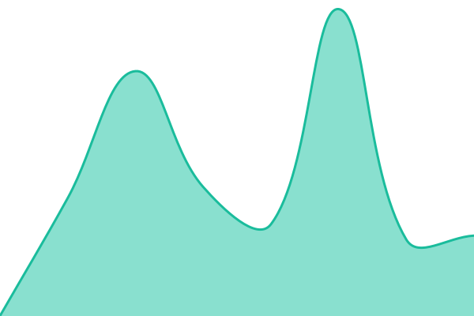

# [📈 Live Status](https://status.schirmedia.cc): <!--live status--> **🟧 Partial outage**

This repository contains the open-source uptime monitor and status page for [K1ngJony](https://status.schirmedia.cc), powered by [Upptime](https://github.com/upptime/upptime).

With [Upptime](https://upptime.js.org), you can get your own unlimited and free uptime monitor and status page, powered entirely by a GitHub repository. We use [Issues](https://github.com/K1ngJony/upptime/issues) as incident reports, [Actions](https://github.com/K1ngJony/upptime/actions) as uptime monitors, and [Pages](https://status.schirmedia.cc) for the status page.

<!--start: status pages-->
<!-- This summary is generated by Upptime (https://github.com/upptime/upptime) -->
<!-- Do not edit this manually, your changes will be overwritten -->
<!-- prettier-ignore -->
| URL | Status | History | Response Time | Uptime |
| --- | ------ | ------- | ------------- | ------ |
|  [Homepage](https://schirmedia.cc) | 🟩 Up | [homepage.yml](https://github.com/K1ngJony/upptime/commits/HEAD/history/homepage.yml) | 

 1146ms
     
 | 

<a href="https://status.schirmedia.cc/history/homepage">100.00%</a>
    

|  [Plex Server](schirmedia.cc) | 🟥 Down | [plex-server.yml](https://github.com/K1ngJony/upptime/commits/HEAD/history/plex-server.yml) | 

 0ms
     
 | 

<a href="https://status.schirmedia.cc/history/plex-server">0.00%</a>
    

|  [Plex Authentication & API](https://plex.tv) | 🟩 Up | [plex-authentication-and-api.yml](https://github.com/K1ngJony/upptime/commits/HEAD/history/plex-authentication-and-api.yml) | 

 1859ms
     
 | 

<a href="https://status.schirmedia.cc/history/plex-authentication-and-api">100.00%</a>
    

<!--end: status pages-->

[**Visit my status website →**](https://status.schirmedia.cc)

## 📄 License

- Powered by: [Upptime](https://github.com/upptime/upptime)
- Code: [MIT](./LICENSE) © [K1ngJony](https://status.schirmedia.cc)
- Data in the `./history` directory: [Open Database License](https://opendatacommons.org/licenses/odbl/1-0/)
